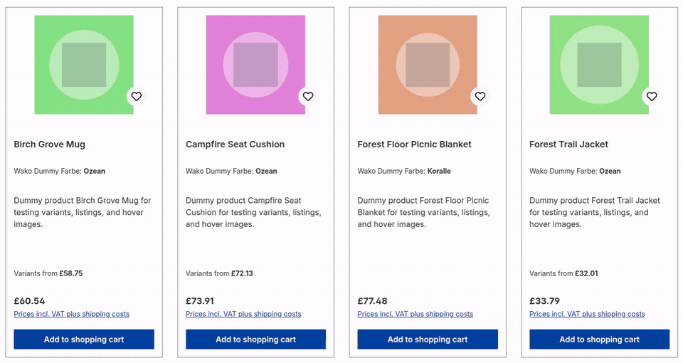

# WakoProductHoverImage

**Product Hover Image / Produktbild bei Hover** is a Shopware 6.7 Storefront
plugin by WariKoda. It displays a configurable product image when a mouse or
supported pen hovers over a product box.

## Demo

[](docs/product-hover-image-demo.mp4)

Click the preview to watch the MP4 video.

## Features

- Listings, search results, CMS product boxes and sliders, cross-selling, customer wishlist, and guest wishlist
- Standard, minimal, image, and wishlist product-box layouts
- Sales-Channel-specific activation and settings
- Five image-selection strategies
- Native lazy loading or loading after a configurable hover delay
- Configurable fade duration
- Separate toggles for listings, CMS elements, cross-selling, and wishlists
- Variant-only, Shopware-inheritance, and explicit parent-fallback modes
- Product media selection through the generated `wako_product_hover_image_media_id` custom field
- No additional HTTP endpoint or product-data request
- In `on_hover` mode, no image request occurs before a supported hover and its delay
- Touch and keyboard interaction do not activate the overlay
- Support for AJAX listings and dynamically replaced product boxes
- Deterministic media order by `product_media.position`, then `product_media.id`
- Existing media-association criteria from themes or plugins remain unchanged
- `prefers-reduced-motion` support

Search suggestions, aggregation-only search requests, and product-detail
galleries are intentionally excluded.

## Requirements

- Shopware Core `~6.7.10`
- Shopware Storefront `~6.7.10`

## Installation

Place the plugin in `custom/plugins/WakoProductHoverImage`, then run:

```bash
composer dump-autoload
bin/console plugin:refresh
bin/console plugin:install --activate WakoProductHoverImage
bin/console cache:clear
bin/build-storefront.sh
```

Open **Extensions > My extensions > Product Hover Image > Configuration** and
enable the option globally or for selected Sales Channels. It is disabled by
default.

## Uninstallation

```bash
bin/console plugin:uninstall WakoProductHoverImage
```

This removes the generated custom-field set and its product assignments. Add
`--keep-user-data` to preserve them for a later reinstallation.

## Configuration

The `loadingMode` setting controls when the browser can request the image. The
default, `lazy`, renders it with native `loading="lazy"`. In `on_hover` mode,
the image remains inert until a supported hover lasts for the configured delay.

The selection strategy can use:

1. The exact second media item.
2. The first valid image different from the cover.
3. A configured 1-based position in the sorted collection.
4. The media selected in the product custom field
   `wako_product_hover_image_media_id`.
5. The next valid image after the cover.

Media are sorted by `product_media.position` and then `product_media.id`. Cover
and hover media must have a URL and Shopware media type `IMAGE`. The default
strategy remains the exact second item and does not silently fall back to a
third item.

The generated product custom field accepts only media assigned to the product's
applicable media collection. Media-library files therefore cannot bypass product
assignment and variant rules.

Variant handling supports Shopware inheritance, variant-owned media, or
variant-owned media with a separately loaded parent fallback. The plugin fetches
parent products in one batched repository query because Shopware does not allow
the product `parent` association in Sales Channel criteria.

The plugin sorts media associations that it creates. It limits them only when a
finite prefix can resolve the selected strategy. It does not change existing
association filters, sorting, limits, fields, offsets, queries, aggregations, or
states. It also skips partial-field criteria. As a result, no hover image may be
available when another extension supplies an incomplete media collection.

## Pointer and image-loading behavior

A delegated listener handles existing and newly added `.product-box` elements.
In `lazy` mode, the browser may request the image before any hover. In `on_hover`
mode, the markup stays in an inert `<template>` until the configured delay has
elapsed. Moving the pointer away before then cancels activation without creating
an image request.

The overlay appears only after the image loads and a fine mouse or pen pointer is
hovering without screen contact. Otherwise, the cover remains visible. The
plugin removes failed images and does not retry them during the marker's DOM
lifecycle. Reduced-motion preferences disable the configured fade transition.

## Theme and plugin compatibility

The theme must retain Shopware's `component_product_box_image_inner` block and a
recognizable `.product-box .product-image-wrapper` structure. A theme that
replaces that block without `parent()` can suppress the marker and needs a small
compatibility template.

The classes `cover-switch` and `.variant-image-switched` are used only as passive
DOM/CSS conventions. There is no PHP, JavaScript, or Composer dependency on a
variant-listing plugin.

Do not run this plugin together with a SharpThemeDelight release that still
contains its own product-box hover-image implementation. Doing so can add two
criteria subscribers, templates, listeners, and image overlays.

## Development and quality checks

```bash
# Standalone plugin checkout
composer install
composer test:unit
composer analyse

# Alternatively, use PHPUnit supplied by the Shopware project
../../../vendor/bin/phpunit -c phpunit.xml.dist

# Storefront Jest, using Shopware's dependencies
cd ../../../vendor/shopware/storefront/Resources/app/storefront
npm ci
npx jest --config ../../../../../../custom/plugins/WakoProductHoverImage/src/Resources/app/storefront/jest.config.js --runInBand

# Production assets from custom/plugins/WakoProductHoverImage
../../../bin/build-storefront.sh
```

Also run the project's PHPStan, ECS, Storefront ESLint, and Stylelint tooling.
Generated Storefront assets belong in
`src/Resources/app/storefront/dist/storefront/js/wako-product-hover-image/`.

## Privacy

The plugin sets no cookies, performs no tracking, uses no external service, and
stores no personal data. It requests only media URLs already generated by
Shopware and exposes no additional product-data endpoint.

## License

This plugin is licensed under the MIT License. See `LICENSE`.
